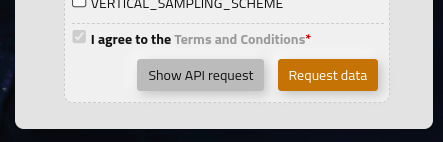

Quick start
===========

Once the WEkEO HDA API client is installed, it can be used to request data from the datasets listed in the `WEkEO catalogue <https://www.wekeo.eu/data?view=viewer>`_.

On the WEkEO portal, under **DATA**, each dataset search has a *Show API request* button, it displays the json request to be used. The request can be formatted using the interactive form. The API call must follow the syntax.

The client can be used directly into another python script as in the following example:

.. code-block:: python

    from hda import Client

    c = Client()

    query = {
        "datasetId": "EO:EUM:DAT:SENTINEL-3:OL_1_EFR___",
        "dateRangeSelectValues": [{
            "end": "2019-07-03T14:03:00.000Z",
            "name": "dtrange",
            "start": "2019-07-03T13:59:00.000Z"
        }],
        "stringChoiceValues": []
    }
    matches = c.search(query)
    print(matches)
    matches.download()

.. note::
    The query must be a json valid object.
    Please refer to the official documentation of the HDA for instructions on how to get the list of the available parameters.

Alternatively, it can be wrapped into a script to be executed from the command line. Please refer to the ``demos/demo.py`` file for a simple demostration.
